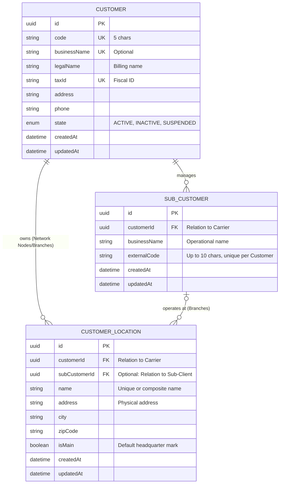

# Entity Relationship Diagram (ERD): Customer Hierarchy

This document describes the data structure for the hierarchical relationship between Carriers, their Sub-Clients, and Physical Locations.

## Diagram

## Relationship Rules

1. **Carrier (Customer)**: 
   - Acts as the root entity. 
   - Owns all data underneath. 
   - Always has full billing data (`taxId`, `legalName`).

2. **Sub-Client (SubCustomer)**:
   - Linked to a single Carrier.
   - **Data Isolation**: If the same physical company is served by two different Carriers, it exists as two distinct `SubCustomer` records.
   - Identified by an `externalCode` (max 10 chars) which is unique within the context of its parent `Customer`.

3. **Locations**:
   - **Network Nodes**: When `subCustomerId` is NULL. These are physical points belonging directly to the Carrier (e.g., repetition nodes).
   - **Branches**: When `subCustomerId` is NOT NULL. These are points where a specific sub-client operates.
   - A `SubCustomer` should have at least one branch (enforced via business logic).

## Architectural Note: Data Flattening

The presence of `customerId` in the `CUSTOMER_LOCATION` table, even when a `subCustomerId` is present, is a deliberate design choice for **Data Flattening** and **Performance**:

1.  **Isolation (Multi-tenancy)**: It allows for immediate filtering of all locations belonging to a Carrier (nodes + all branches of all their sub-clients) without performing JOINs.
2.  **Universal Ownership**: A location always has a legal owner (`Customer`). For "Network Nodes", this is the only link.
3.  **Cross-Check Validation**: In the application layer, we must ensure that `subCustomer.customerId == location.customerId` during creation to maintain integrity.
