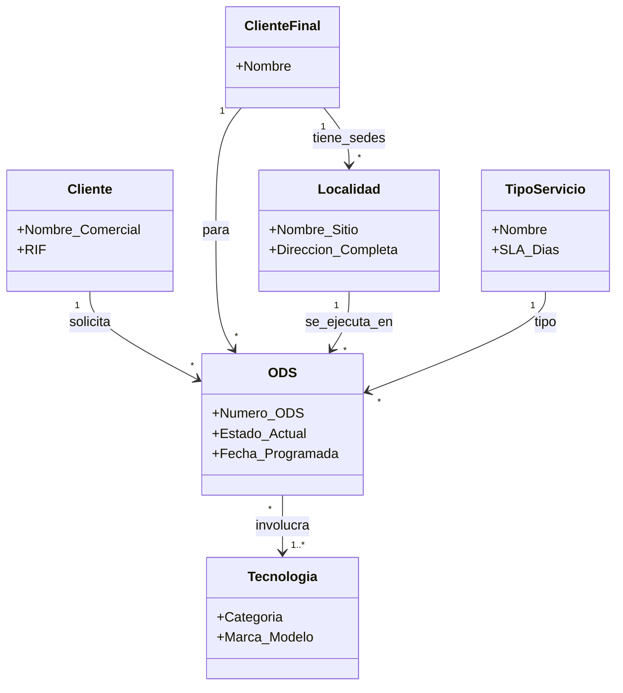
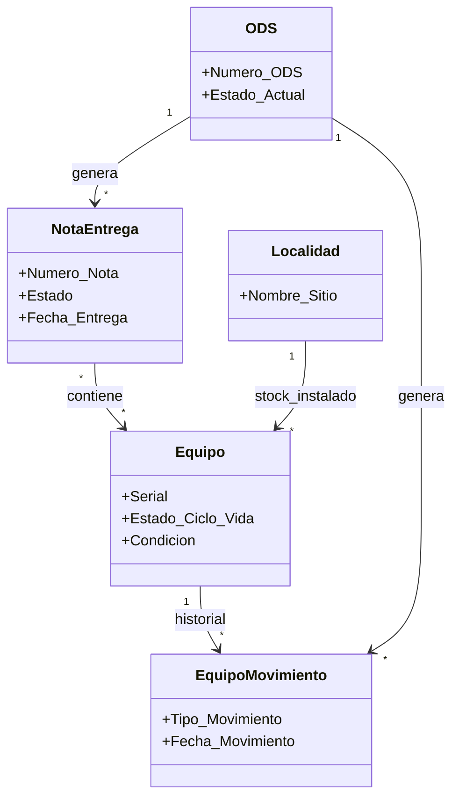
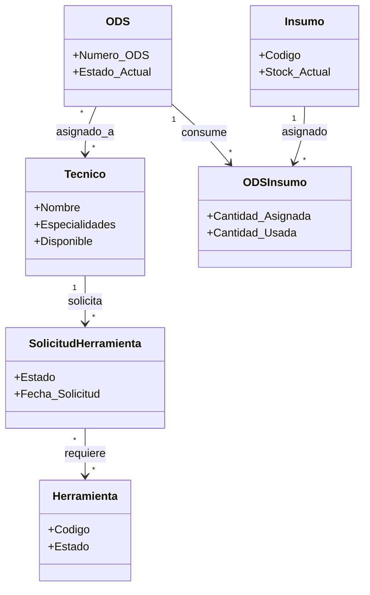
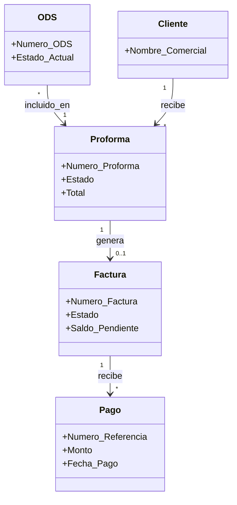
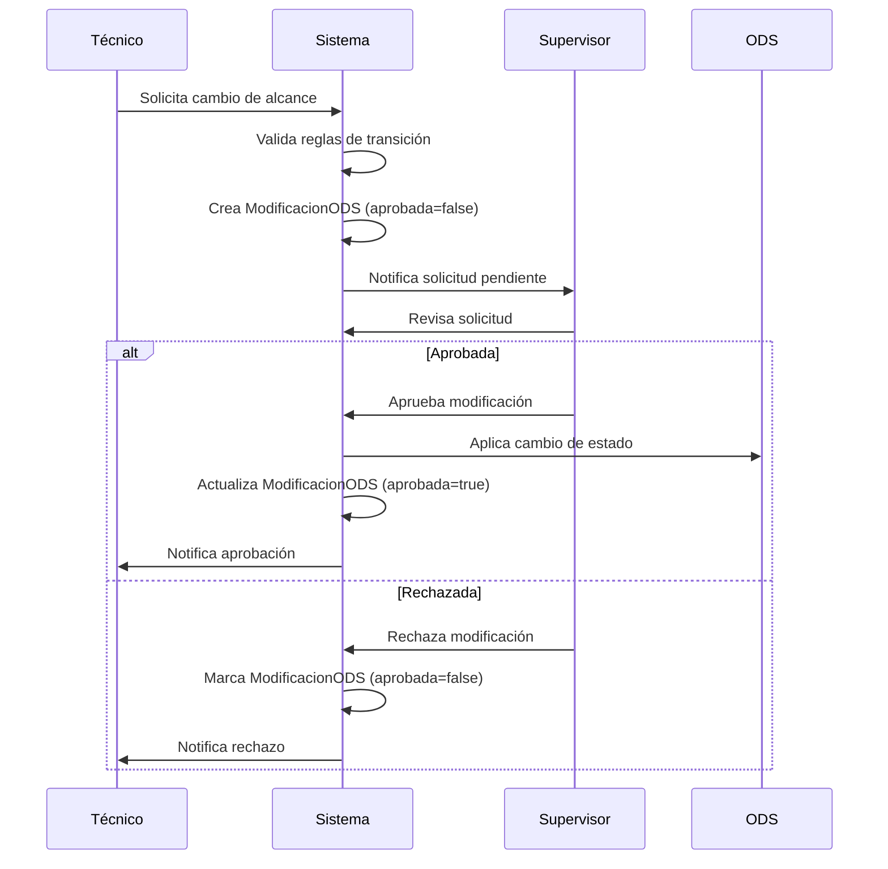

# Diagrama de Modelado de Dominio - SGCV2

Este documento presenta el modelo de dominio completo del Sistema de Gestión y Control para XTEL Comunicaciones.

## Diagrama Completo de Entidades

```mermaid
classDiagram
    %% ============================================
    %% MÓDULO DE CLIENTES Y LOCALIDADES
    %% ============================================
    class Cliente {
        +ID_Cliente PK
        +Nombre_Comercial String
        +Razon_Social String
        +RIF String
        +Direccion String
        +Telefono String
        +Email String
        +Estado Enum
        +Fecha_Registro DateTime
    }

    class ClienteFinal {
        +ID_Cliente_Final PK
        +Nombre String
        +Sector_Industria String
        +Observaciones Text
    }

    class Localidad {
        +ID_Localidad PK
        +ID_Cliente_Final FK
        +Nombre_Sitio String
        +Direccion_Completa String
        +Coordenadas_GPS String
        +Persona_Contacto String
        +Telefono_Contacto String
        +Horario_Acceso String
        +Restricciones_Permisos Text
        +Observaciones Text
    }

    %% ============================================
    %% MÓDULO DE ÓRDENES DE SERVICIO (ODS)
    %% ============================================
    class ODS {
        +ID_ODS PK
        +Numero_ODS String~Unique~
        +Numero_Orden_Cliente String
        +ID_Cliente FK
        +ID_Cliente_Final FK
        +ID_Localidad FK
        +ID_Tipo_Servicio FK
        +Estado_Actual Enum
        +Fecha_Creacion DateTime
        +Fecha_Programada DateTime
        +Fecha_Ejecucion DateTime
        +Fecha_Culminacion DateTime
        +Descripcion Text
        +Diagnostico_Inicial Text
        +Observaciones Text
        +Usuario_Creador FK
        +Prioridad Enum
    }

    class TipoServicio {
        +ID_Tipo_Servicio PK
        +Nombre String
        +Descripcion Text
        +Requiere_Informe_Post Boolean
        +SLA_Dias Integer
    }

    class ODSEstadoHistorial {
        +ID_Historial PK
        +ID_ODS FK
        +Estado_Anterior String
        +Estado_Nuevo String
        +Fecha_Cambio DateTime
        +Usuario_Responsable FK
        +Observaciones Text
    }

    %% ============================================
    %% MÓDULO DE WORKFLOW FLEXIBLE
    %% ============================================
    class WorkflowDefinicion {
        +ID_Workflow PK
        +ID_Tipo_Servicio FK
        +Nombre String
        +Descripcion Text
        +Version Integer
        +Activo Boolean
        +Fecha_Creacion DateTime
    }

    class WorkflowEstado {
        +ID_Estado PK
        +ID_Workflow FK
        +Codigo_Estado String
        +Nombre_Estado String
        +Descripcion Text
        +Es_Estado_Inicial Boolean
        +Es_Estado_Final Boolean
        +Color String
        +Orden Integer
    }

    class WorkflowTransicion {
        +ID_Transicion PK
        +ID_Workflow FK
        +ID_Estado_Origen FK
        +ID_Estado_Destino FK
        +Nombre_Accion String
        +Requiere_Aprobacion Boolean
        +Requiere_Justificacion Boolean
        +Validaciones JSON
    }

    class ReglaTransicion {
        +ID_Regla PK
        +ID_Transicion FK
        +Tipo_Regla Enum
        +Condicion JSON
        +Mensaje_Error Text
    }

    class ModificacionODS {
        +ID_Modificacion PK
        +ID_ODS FK
        +ID_Transicion FK
        +Tipo_Modificacion Enum
        +Estado_Anterior String
        +Estado_Nuevo String
        +Justificacion Text
        +Requiere_Aprobacion Boolean
        +Aprobada Boolean
        +Usuario_Solicita FK
        +Usuario_Aprueba FK
        +Fecha_Solicitud DateTime
        +Fecha_Aprobacion DateTime
        +Datos_Adicionales JSON
    }

    class Configuracion {
        +ID_Configuracion PK
        +ID_ODS FK
        +Parametros_Tecnicos JSON
        +Archivo_Config String
        +Estado Enum
        +Fecha_Carga DateTime
        +Usuario_Cargo FK
    }

    %% ============================================
    %% MÓDULO DE TECNOLOGÍAS
    %% ============================================
    class Tecnologia {
        +ID_Tecnologia PK
        +Categoria String
        +Subcategoria String
        +Marca String
        +Modelo String
        +Especificaciones Text
    }

    class ODSTecnologia {
        +ID_ODS FK
        +ID_Tecnologia FK
    }

    %% ============================================
    %% MÓDULO DE EQUIPOS
    %% ============================================
    class Equipo {
        +ID_Equipo PK
        +Serial String~Unique~
        +ID_Cliente_Propietario FK
        +ID_Tecnologia FK
        +Marca String
        +Modelo String
        +Estado_Ciclo_Vida Enum
        +ID_Localidad_Instalado FK
        +Ubicacion_Almacen String
        +Condicion Enum
        +Fecha_Recepcion DateTime
        +Observaciones Text
    }

    class EquipoMovimiento {
        +ID_Movimiento PK
        +ID_Equipo FK
        +ID_ODS FK
        +Tipo_Movimiento Enum
        +Estado_Anterior String
        +Estado_Nuevo String
        +Fecha_Movimiento DateTime
        +Usuario_Responsable FK
        +Observaciones Text
    }

    class NotaEntrega {
        +ID_Nota_Entrega PK
        +Numero_Nota String~Unique~
        +ID_ODS FK
        +Tipo Enum
        +Estado Enum
        +Transportista String
        +Numero_Guia String
        +Fecha_Despacho DateTime
        +Fecha_Entrega DateTime
        +Firma_Cliente Blob
        +Observaciones Text
    }

    class NotaEntregaDetalle {
        +ID_Detalle PK
        +ID_Nota_Entrega FK
        +ID_Equipo FK
        +Condicion String
    }

    %% ============================================
    %% MÓDULO DE HERRAMIENTAS
    %% ============================================
    class Herramienta {
        +ID_Herramienta PK
        +Codigo_Herramienta String~Unique~
        +Nombre String
        +Descripcion Text
        +Categoria String
        +Estado Enum
        +Condicion Enum
        +Valor Decimal
        +Fecha_Adquisicion Date
        +Proveedor String
        +Foto String
    }

    class SolicitudHerramienta {
        +ID_Solicitud_Herramienta PK
        +ID_Tecnico FK
        +Estado Enum
        +Fecha_Solicitud DateTime
        +Fecha_Requerida DateTime
        +Fecha_Entrega DateTime
        +Fecha_Devolucion DateTime
        +Observaciones Text
    }

    class SolicitudHerramientaDetalle {
        +ID_Detalle PK
        +ID_Solicitud_Herramienta FK
        +ID_Herramienta FK
        +Cantidad Integer
    }

    class SolicitudHerramientaODS {
        +ID_Solicitud_Herramienta FK
        +ID_ODS FK
    }

    %% ============================================
    %% MÓDULO DE INSUMOS
    %% ============================================
    class Insumo {
        +ID_Insumo PK
        +Codigo_Insumo String~Unique~
        +Nombre String
        +Descripcion Text
        +Categoria String
        +Unidad_Medida String
        +Stock_Actual Decimal
        +Stock_Minimo Decimal
        +Stock_Maximo Decimal
        +Costo_Unitario Decimal
        +Proveedor_Principal String
        +Ubicacion_Almacen String
        +Foto String
    }

    class ODSInsumo {
        +ID_Asignacion PK
        +ID_ODS FK
        +ID_Insumo FK
        +Cantidad_Asignada Decimal
        +Cantidad_Devuelta Decimal
        +Cantidad_Usada Decimal
        +Fecha_Asignacion DateTime
        +Fecha_Devolucion DateTime
        +Estado Enum
    }

    %% ============================================
    %% MÓDULO DE TÉCNICOS Y PERSONAL
    %% ============================================
    class Empleado {
        +ID_Empleado PK
        +Cedula String~Unique~
        +Nombre String
        +Apellido String
        +Fecha_Nacimiento Date
        +Telefono String
        +Email String
        +Direccion Text
        +Fecha_Ingreso Date
        +Cargo String
        +Departamento String
        +Tipo_Contrato String
        +Salario_Base Decimal
        +Estado Enum
        +Datos_Bancarios String
        +Contacto_Emergencia String
        +Foto String
    }

    class Tecnico {
        +ID_Tecnico PK
        +ID_Empleado FK
        +Especialidades JSON
        +Disponible Boolean
        +Nivel Enum
    }

    class ODSTecnico {
        +ID_Asignacion PK
        +ID_ODS FK
        +ID_Tecnico FK
        +Rol Enum
        +Fecha_Asignacion DateTime
    }

    %% ============================================
    %% MÓDULO DE INFORMES
    %% ============================================
    class InformeServicio {
        +ID_Informe_Servicio PK
        +ID_ODS FK
        +Hora_Inicio Time
        +Hora_Fin Time
        +Trabajo_Realizado Text
        +Observaciones Text
        +Firma_Cliente Blob
        +Archivo_Escaneado String
        +Fecha_Carga DateTime
    }

    class InformeTecnico {
        +ID_Informe_Tecnico PK
        +ID_ODS FK
        +Tipo_Informe Enum
        +Contenido Text
        +Fecha_Creacion DateTime
        +Usuario_Creador FK
    }

    class InformeImagen {
        +ID_Imagen PK
        +ID_Informe_Tecnico FK
        +Archivo_Imagen String
        +Descripcion Text
        +Orden Integer
    }

    %% ============================================
    %% MÓDULO DE FINANZAS
    %% ============================================
    class Proforma {
        +ID_Proforma PK
        +Numero_Proforma String~Unique~
        +ID_Cliente FK
        +Fecha_Emision Date
        +Fecha_Envio Date
        +Fecha_Aprobacion Date
        +Estado Enum
        +Subtotal Decimal
        +Impuestos Decimal
        +Total Decimal
        +Observaciones_Cliente Text
        +Archivo_PDF String
    }

    class ProformaDetalle {
        +ID_Detalle PK
        +ID_Proforma FK
        +ID_ODS FK
        +Descripcion Text
        +Monto Decimal
    }

    class Factura {
        +ID_Factura PK
        +Numero_Factura String~Unique~
        +ID_Proforma FK
        +ID_Cliente FK
        +Fecha_Emision Date
        +Fecha_Vencimiento Date
        +Estado Enum
        +Base_Imponible Decimal
        +Impuestos Decimal
        +Total Decimal
        +Saldo_Pendiente Decimal
        +Archivo_PDF String
    }

    class Pago {
        +ID_Pago PK
        +ID_Factura FK
        +Numero_Referencia String
        +Fecha_Pago Date
        +Monto Decimal
        +Metodo_Pago String
        +Banco String
        +Comprobante String
        +Usuario_Registro FK
    }

    %% ============================================
    %% MÓDULO DE SEGURIDAD
    %% ============================================
    class Usuario {
        +ID_Usuario PK
        +ID_Empleado FK
        +Username String~Unique~
        +Password_Hash String
        +Email String
        +Estado Enum
        +Fecha_Ultimo_Acceso DateTime
        +Intentos_Fallidos Integer
        +Foto_Perfil String
    }

    class Rol {
        +ID_Rol PK
        +Nombre_Rol String
        +Descripcion Text
    }

    class UsuarioRol {
        +ID_Usuario FK
        +ID_Rol FK
    }

    class Permiso {
        +ID_Permiso PK
        +Modulo String
        +Funcionalidad String
        +Accion Enum
    }

    class RolPermiso {
        +ID_Rol FK
        +ID_Permiso FK
    }

    class Auditoria {
        +ID_Auditoria PK
        +ID_Usuario FK
        +Fecha_Hora DateTime
        +Accion String
        +Modulo String
        +Registro_Afectado String
        +Valores_Anteriores JSON
        +Valores_Nuevos JSON
        +IP_Origen String
    }

    %% ============================================
    %% RELACIONES PRINCIPALES
    %% ============================================

    %% Clientes y Localidades
    ClienteFinal "1" --> "*" Localidad : tiene

    %% ODS Core
    Cliente "1" --> "*" ODS : solicita
    ClienteFinal "1" --> "*" ODS : para
    Localidad "1" --> "*" ODS : en
    TipoServicio "1" --> "*" ODS : tipo
    ODS "1" --> "*" ODSEstadoHistorial : historial
    ODS "1" --> "0..1" Configuracion : requiere

    %% Workflow Flexible
    TipoServicio "1" --> "*" WorkflowDefinicion : tiene
    WorkflowDefinicion "1" --> "*" WorkflowEstado : define
    WorkflowDefinicion "1" --> "*" WorkflowTransicion : define
    WorkflowEstado "1" --> "*" WorkflowTransicion : origen
    WorkflowEstado "1" --> "*" WorkflowTransicion : destino
    WorkflowTransicion "1" --> "*" ReglaTransicion : tiene
    ODS "1" --> "*" ModificacionODS : modificaciones
    WorkflowTransicion "1" --> "*" ModificacionODS : usa
    Usuario "1" --> "*" ModificacionODS : solicita
    Usuario "1" --> "*" ModificacionODS : aprueba

    %% Tecnologías
    ODS "*" --> "*" Tecnologia : usa
    ODSTecnologia "N" --> "1" ODS
    ODSTecnologia "N" --> "1" Tecnologia

    %% Equipos
    Cliente "1" --> "*" Equipo : propietario
    Tecnologia "1" --> "*" Equipo : tipo
    Localidad "1" --> "*" Equipo : instalado_en
    Equipo "1" --> "*" EquipoMovimiento : historial
    ODS "1" --> "*" EquipoMovimiento : genera

    %% Notas de Entrega
    ODS "1" --> "*" NotaEntrega : genera
    NotaEntrega "1" --> "*" NotaEntregaDetalle : contiene
    Equipo "1" --> "*" NotaEntregaDetalle : incluye

    %% Herramientas
    Tecnico "1" --> "*" SolicitudHerramienta : solicita
    SolicitudHerramienta "1" --> "*" SolicitudHerramientaDetalle : detalle
    Herramienta "1" --> "*" SolicitudHerramientaDetalle : item
    SolicitudHerramienta "*" --> "*" ODS : para
    SolicitudHerramientaODS "N" --> "1" SolicitudHerramienta
    SolicitudHerramientaODS "N" --> "1" ODS

    %% Insumos
    ODS "1" --> "*" ODSInsumo : asigna
    Insumo "1" --> "*" ODSInsumo : consumido

    %% Técnicos
    Empleado "1" --> "0..1" Tecnico : es
    ODS "*" --> "*" Tecnico : asignado_a
    ODSTecnico "N" --> "1" ODS
    ODSTecnico "N" --> "1" Tecnico

    %% Informes
    ODS "1" --> "0..1" InformeServicio : tiene
    ODS "1" --> "*" InformeTecnico : genera
    InformeTecnico "1" --> "*" InformeImagen : contiene

    %% Finanzas
    Cliente "1" --> "*" Proforma : recibe
    Proforma "1" --> "*" ProformaDetalle : detalle
    ODS "1" --> "*" ProformaDetalle : incluido_en
    Proforma "1" --> "0..1" Factura : genera
    Cliente "1" --> "*" Factura : para
    Factura "1" --> "*" Pago : recibe

    %% Seguridad
    Empleado "1" --> "0..1" Usuario : tiene
    Usuario "*" --> "*" Rol : tiene
    UsuarioRol "N" --> "1" Usuario
    UsuarioRol "N" --> "1" Rol
    Rol "*" --> "*" Permiso : tiene
    RolPermiso "N" --> "1" Rol
    RolPermiso "N" --> "1" Permiso
    Usuario "1" --> "*" Auditoria : genera
```



## Vistas Especializadas del Modelo

### Vista 1: Flujo de ODS y Clientes



### Vista 2: Gestión de Equipos y Logística



### Vista 3: Recursos y Asignaciones



### Vista 4: Ciclo Financiero



## Sistema de Workflow Flexible

### Descripción General

El sistema permite configurar workflows personalizados por tipo de servicio, con la capacidad de:

- Definir estados personalizados más allá de los estados base
- Configurar transiciones permitidas entre estados
- Establecer reglas de validación para cada transición
- Requerir aprobaciones para cambios críticos
- Mantener auditoría completa de todas las modificaciones

### Componentes del Sistema

#### 1. WorkflowDefinicion

Define el workflow completo para un tipo de servicio específico. Permite versionamiento para evolucionar los procesos sin perder historial.

**Ejemplo:**

```json
{
  "id_workflow": 1,
  "id_tipo_servicio": 2,
  "nombre": "Workflow Instalación v2.0",
  "version": 2,
  "activo": true
}
```

#### 2. WorkflowEstado

Estados personalizables del workflow. Cada estado puede tener propiedades visuales (color) y lógicas (inicial/final).

**Estados Base (obligatorios):**

- PENDIENTE
- EN_PROGRESO
- COMPLETADA
- CERRADA

**Estados Personalizables (ejemplos):**

- PAUSADA
- REQUIERE_APROBACION
- MATERIALES_PENDIENTES
- REPROGRAMADA
- EN_REVISION
- ESPERANDO_CLIENTE

#### 3. WorkflowTransicion

Define las transiciones permitidas entre estados, con opciones de validación y aprobación.

**Ejemplo:**

```json
{
  "id_transicion": 15,
  "nombre_accion": "Pausar por Falta de Materiales",
  "estado_origen": "EN_PROGRESO",
  "estado_destino": "MATERIALES_PENDIENTES",
  "requiere_aprobacion": false,
  "requiere_justificacion": true,
  "validaciones": {
    "roles_permitidos": ["TECNICO", "SUPERVISOR"],
    "campos_requeridos": ["justificacion", "materiales_faltantes"]
  }
}
```

#### 4. ReglaTransicion

Validaciones específicas que deben cumplirse para permitir una transición.

**Tipos de Reglas:**

- **VALIDACION_CAMPO**: Verifica que ciertos campos estén completos
- **VALIDACION_RECURSO**: Verifica disponibilidad de recursos
- **VALIDACION_PERMISO**: Verifica permisos del usuario
- **VALIDACION_NEGOCIO**: Lógica de negocio personalizada
- **VALIDACION_TEMPORAL**: Restricciones de tiempo

**Ejemplo:**

```json
{
  "tipo_regla": "VALIDACION_RECURSO",
  "condicion": {
    "tipo": "equipos_asignados",
    "minimo": 1
  },
  "mensaje_error": "No se puede pasar a COORDINADO sin equipos asignados"
}
```

#### 5. ModificacionODS

Registro de todas las modificaciones realizadas a una ODS, incluyendo cambios de estado y modificaciones de alcance.

**Tipos de Modificación:**

- **CAMBIO_ESTADO**: Transición normal de estado
- **CAMBIO_ALCANCE**: Modificación del alcance del trabajo
- **PAUSA**: Pausa temporal de la ODS
- **REPROGRAMACION**: Cambio de fecha programada
- **CANCELACION**: Cancelación de la ODS
- **REACTIVACION**: Reactivación de ODS pausada/cancelada

### Matriz de Permisos por Rol

| Acción                 | Técnico | Supervisor | Coordinador | Gerente Ops |
| ---------------------- | ------- | ---------- | ----------- | ----------- |
| Pausar ODS             | ✅      | ✅         | ✅          | ✅          |
| Solicitar Materiales   | ✅      | ✅         | ✅          | ✅          |
| Reprogramar            | ❌      | ✅         | ✅          | ✅          |
| Cambiar Alcance        | ❌      | ✅         | ✅          | ✅          |
| Modificar Workflow     | ❌      | ❌         | ❌          | ✅          |
| Cancelar ODS           | ❌      | ❌         | ✅          | ✅          |
| Aprobar Modificaciones | ❌      | ✅         | ✅          | ✅          |

### Flujo de Modificación con Aprobación



### Ejemplo de Configuración: Instalación

**Workflow Personalizado para Instalación:**

```
NUEVO
  ↓ [Asignar Recursos] → requiere: técnicos + equipos
PENDIENTE_ASIGNACIONES
  ↓ [Confirmar Recursos] → validación: todos los recursos OK
POR_COORDINAR
  ↓ [Coordinar con Cliente] → requiere: fecha + contacto
COORDINADO
  ↓ [Iniciar Trabajo]
EN_PROGRESO
  ↓ [Pausar] → requiere: justificación
PAUSADA
  ↓ [Reanudar] → requiere: aprobación supervisor
EN_PROGRESO
  ↓ [Completar Trabajo]
COMPLETADA
  ↓ [Cargar Informe] → requiere: informe + firma cliente
CULMINADA
  ↓ [Generar Proforma]
FACTURADA
  ↓ [Registrar Pago]
CERRADA
```

### Trazabilidad y Auditoría

Cada modificación registra:

- **Quién**: Usuario que solicita y usuario que aprueba
- **Qué**: Estado anterior, estado nuevo, tipo de modificación
- **Cuándo**: Fecha de solicitud y fecha de aprobación
- **Por qué**: Justificación obligatoria
- **Cómo**: Datos adicionales en formato JSON

**Ejemplo de Registro:**

```json
{
  "id_modificacion": 1523,
  "id_ods": 456,
  "tipo_modificacion": "PAUSA",
  "estado_anterior": "EN_PROGRESO",
  "estado_nuevo": "PAUSADA",
  "justificacion": "Cliente no disponible hasta próxima semana",
  "usuario_solicita": "tecnico_juan",
  "fecha_solicitud": "2025-11-21T10:30:00",
  "requiere_aprobacion": false,
  "aprobada": true,
  "datos_adicionales": {
    "fecha_estimada_reanudacion": "2025-11-28",
    "contacto_cliente": "Maria Perez",
    "telefono": "+58-414-1234567"
  }
}
```

## Enumeraciones y Catálogos

### Estados de ODS por Tipo de Servicio

**Inspección:**

- NUEVO
- POR_COORDINAR
- COORDINACION_RECHAZADA
- COORDINADO
- POR_REALIZAR
- REALIZANDO
- POR_INFORME
- CULMINADO
- PROFORMA
- FACTURADO
- PAGADO

**Instalación:**

- NUEVO
- PENDIENTE_POR_ASIGNACIONES
- PENDIENTE_POR_EQUIPOS
- POR_COORDINAR
- COORDINACION_RECHAZADA
- COORDINADO
- POR_REALIZAR
- REALIZANDO
- POR_INFORME
- CULMINADO
- PROFORMA
- FACTURADO
- PAGADO

**Mantenimiento Correctivo:**

- NUEVO
- PENDIENTE_ASIGNACION
- REALIZANDO
- POR_NOTA_DE_ENTREGA
- EQUIPOS_POR_ENTREGAR
- CULMINADO
- PROFORMA
- FACTURADO
- PAGADO

### Estados de Equipos

- **ALMACEN**: En bodega de XTEL
- **TRANSITO**: En poder del técnico
- **INSTALADO**: En localidad del cliente
- **PENDIENTE_NOTA_ENTREGA**: Esperando devolución
- **ENTREGADO**: Devuelto al cliente

### Estados de Herramientas

- **ALMACEN**: Disponible en bodega
- **TRASLADO**: En poder del técnico
- **MANTENIMIENTO**: En reparación
- **BAJA**: Fuera de servicio

### Roles de Usuario

- Administrador del Sistema
- Gerente General
- Gerente de Operaciones
- Coordinador
- Asistente de Operaciones
- Técnico
- Gerente de Logística
- Almacenista
- Gerente de Administración
- Contador
- Analista de RRHH

## Reglas de Negocio Clave

### Reglas Generales

1. **Una ODS solo puede estar en un estado a la vez**
2. **Un equipo solo puede estar instalado en una localidad**
3. **Un técnico no puede tener múltiples ODS REALIZANDO simultáneamente**
4. **Una herramienta en TRASLADO debe tener una solicitud activa**
5. **Los equipos temporales en correctivos deben regresar o quedar instalados**
6. **Una factura solo puede generarse desde una proforma aprobada**
7. **El stock de insumos no puede ser negativo**
8. **Una ODS no puede pasar a COORDINADO sin tener todos los recursos asignados**
9. **Cada cambio de estado de ODS debe registrarse en el historial**
10. **Los equipos instalados deben estar asociados a una localidad**

### Reglas de Workflow Flexible

11. **Cada tipo de servicio debe tener un workflow activo definido**
12. **Las transiciones de estado deben estar definidas en el workflow correspondiente**
13. **No se puede transicionar a un estado si no existe una transición válida**
14. **Las modificaciones que requieren aprobación no se aplican hasta ser aprobadas**
15. **Toda modificación de ODS debe tener una justificación si así lo requiere la transición**
16. **Solo usuarios con permisos pueden realizar transiciones específicas**
17. **Las reglas de validación de una transición deben cumplirse antes de ejecutarla**
18. **El historial de modificaciones es inmutable (solo inserción, no actualización)**
19. **Una ODS pausada debe tener una fecha estimada de reanudación**
20. **Los cambios de alcance requieren aprobación de supervisor o superior**

## Cardinalidades Importantes

- **Cliente → ODS**: 1:N (Un cliente puede tener muchas ODS)
- **ODS → Técnico**: N:M (Una ODS puede tener varios técnicos, un técnico puede tener varias ODS)
- **ODS → Equipo**: N:M (Una ODS puede usar varios equipos, un equipo puede estar en varias ODS a lo largo del tiempo)
- **Localidad → Equipo (instalado)**: 1:N (Una localidad puede tener muchos equipos instalados)
- **ODS → Tecnología**: N:M (Una ODS puede involucrar varias tecnologías)
- **Proforma → ODS**: 1:N (Una proforma agrupa varias ODS)
- **Factura → Pago**: 1:N (Una factura puede tener pagos parciales)

---

**Versión:** 1.0  
**Fecha:** 2025-11-21  
**Basado en:** analisis_diseno.md
