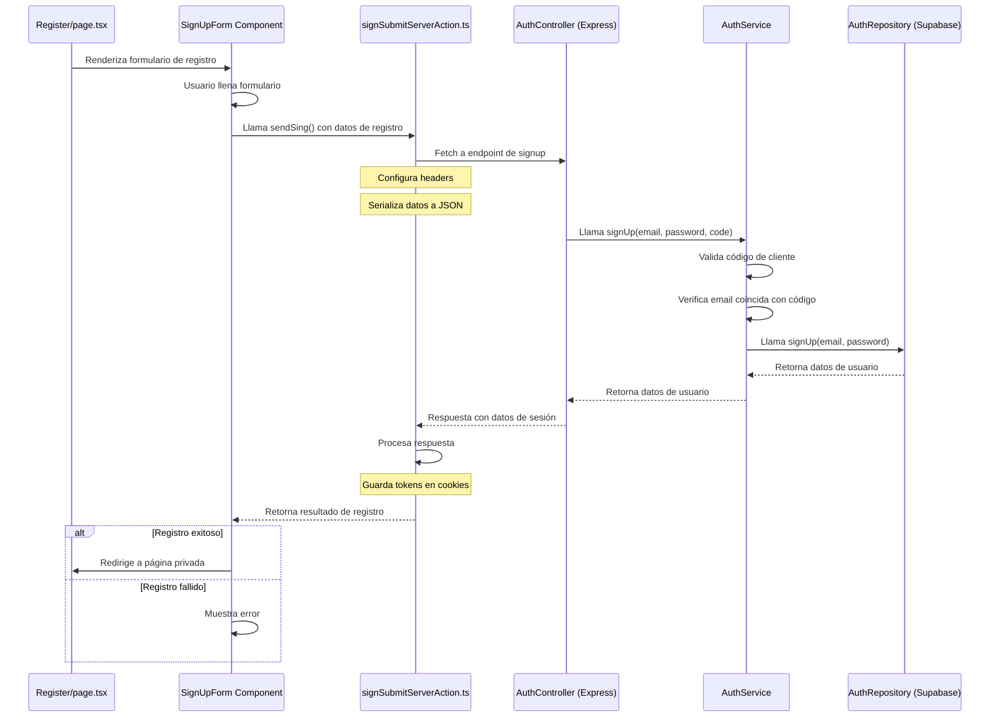

Componentes clave en el flujo:

Frontend (Register/page.tsx)
Renderiza formulario de registro
Maneja interacción del usuario
Formulario de Registro
Recopila datos (email, password, código de cliente)
Invoca acción del servidor
signSubmitServerAction.ts
Realiza fetch al backend
Configura headers
Maneja respuesta
Gestiona cookies
AuthController (Express)
Recibe solicitud de registro
Valida datos de entrada
Invoca servicio de registro
AuthService
Valida código de cliente
Verifica consistencia de datos
Coordina proceso de registro
AuthRepository (Supabase)
Interactúa con base de datos
Crea usuario
Gestiona autenticación
Puntos de atención:

Validación de código de cliente
Manejo de errores
Gestión de sesión y tokens
Redirección tras registro
