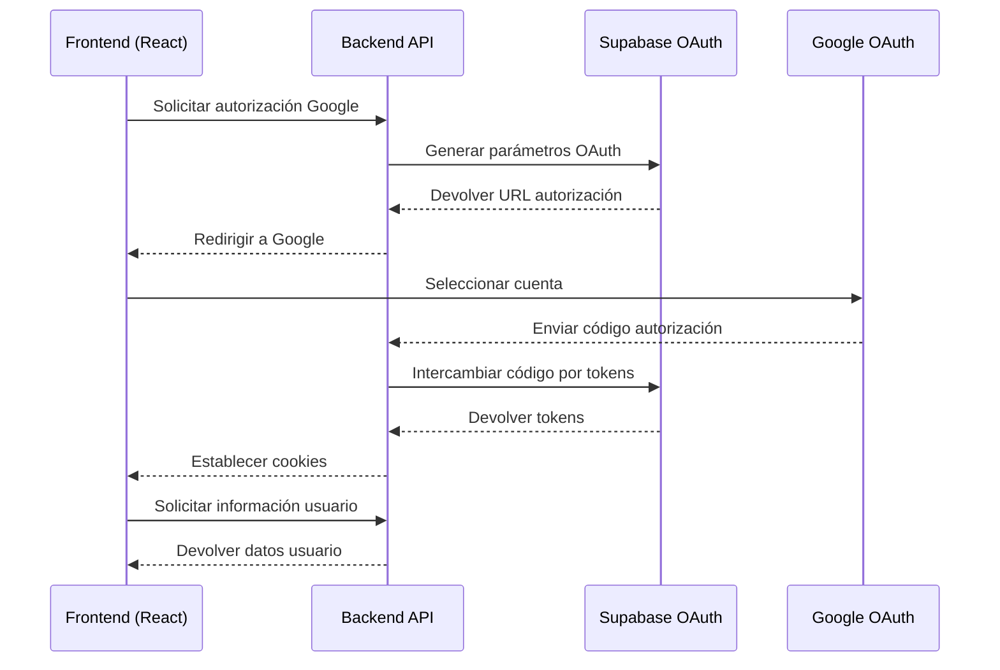

# Flujo de Autenticación OAuth con Google

## Diagrama de Secuencia

## Descripción del Flujo

### 1. Solicitud de Autorización

- **Endpoint**: `GET /v1/auth/authorize`
- **Parámetros**: `provider=google`
- **Respuesta**: URL de autorización de Google y código de verificación PKCE

### 2. Flujo de Autorización de Google

- Redirige al usuario a la página de consentimiento de Google
- Google devuelve un código de autorización

### 3. Callback de Autorización

- **Endpoint**: `GET /v1/auth/callback`
- **Parámetros**:
  - `code`: Código de autorización de Google
  - `state`: Parámetro de verificación
- **Acciones**:
  - Intercambiar código por tokens con Supabase
  - Establecer cookies de acceso y refresco

### 4. Obtención de Información de Usuario

- **Endpoint**: `GET /v1/auth/user`
- **Cabecera**: `Authorization: Bearer {access_token}`
- **Respuesta**: Información básica del usuario

### 🔒 Consideraciones de Seguridad

- Uso de PKCE (Proof Key for Code Exchange)
- Tokens de acceso de corta duración
- Tokens de refresco para renovación
- Cookies HTTP-only y secure
  }
  end

  Frontend->>Google: Redirige a página de consentimiento
  Note over Frontend, Google: Usuario selecciona cuenta

  Google-->>API: Redirige a /v1/auth/callback con código
  Note over API: Recibe código de autorización
  rect rgb(200, 230, 255)
  Note right of API: Parámetros de callback: - code: código_oauth - state: estado_verificación
  end

  API->>Supabase: Intercambia código por tokens
  Supabase-->>API: Devuelve tokens de acceso

  API-->>Frontend: Redirige a /auth/callback
  rect rgb(220, 255, 220)
  Note right of Frontend: Cookies establecidas: - access_token - refresh_token
  end

  Frontend->>API: GET /v1/auth/user
  Note over Frontend, API: Obtener información de usuario
  rect rgb(200, 230, 255)
  Note right of API: Cabeceras: - Authorization: Bearer {access_token}
  end

  API-->>Frontend: Información de usuario
  rect rgb(220, 255, 220)
  Note right of Frontend: Respuesta JSON:
  {
  "status": "success",
  "data": {
  "id": "user_id",
  "email": "usuario@ejemplo.com",
  "name": "Nombre Usuario"
  }
  }
  end
